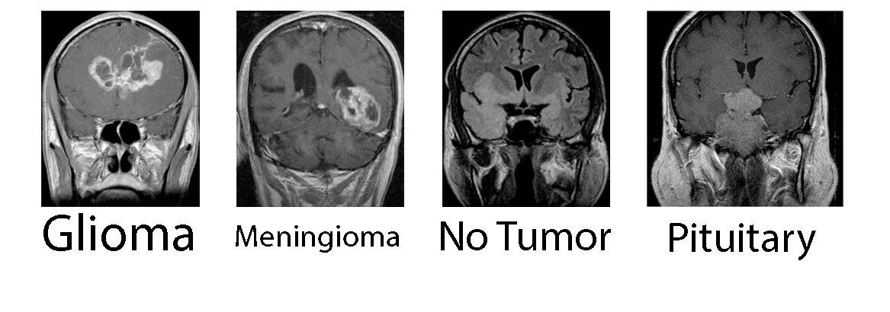

# Brain Tumor Classification

This project classifies brain tumor of the input image. The models are implemented from scratch using PyTorch. The implemented models are:

- [x] AlexNet
- [x] ZFNet
- [x] VGG16 and VGG19
- [x] GoogLeNet
- [x] ResNet18, ResNet34, ResNet50, ResNet101, and ResNet 152

## How to use
In this section, instructions about how to train the models are provided.
### Dataset
The dataset used in the project is Brain Tumor Classification (MRI). You can download it from [Kaggle](https://www.kaggle.com/datasets/sartajbhuvaji/brain-tumor-classification-mri). **There are two preprocessing needed before training the model**:
- As you can see from the dataset, there is black background in some images without any data. I used the extreme points of contour explained in [pyimagesearch](https://pyimagesearch.com/2016/04/11/finding-extreme-points-in-contours-with-opencv/) to crop the images. Hence, the first step you have to do is:
    1. Extract the dataset in the project directory. You should see `dataset` folder beside other project folders.
    2. Execute `preprocessing/crop.py` script. This should create a new folder inside `preprocessing` directory which is called `dataset`. Every image is the same as the original dataset, but the redundant background is removed.
- This dataset has separated the images into Training and Testing; However, the images are separated into Training, Validation, and Testing during training the model. As a result, another script is written which is called `preprocessing/change_structure.py` which should be executed after the previous script. This script receives the `dataset` directory inside `preprocessing` folder and generates a new directory called `final_dataset` in the project root folder. This dataset is used during the training.

### Configuration
All the configurations during training the model can be adjusted in `config.py`.

- **DEVICE**: If cuda is enabled, computations are done using GPU.
- **model**: The model used during training. Available values are:
    - `AlexNet(class_numbers=4, in_channels=1).to(DEVICE)`
    - `ZFNet(class_numbers=4, in_channels=1).to(DEVICE)`
    - `VGG(class_numbers=4, in_channels=1, version=V).to(DEVICE)` such that V could be 16 or 19.
    - `GoogLeNet(class_numbers=4, in_channels=1).to(DEVICE)`
    - `ResNet(class_numbers=4, in_channels=1, version=V).to(DEVICE)` such that V could be 18, 34, 50, 101, and 152.
- **IMAGE_WIDTH** and **IMAGE_HEIGHT**: Note that AlexNet uses 227x227 input images while others use 224x224.
- Train validation test split
    - **TRAIN_RATIO**: Percentage of data used for training.
    - **VALIDATION_RATIO**: Percentage of data used for validation. (hyperparameter tuning)
    - **TEST_RATIO**: Percentage of data used for testing. (Final evaluation)
    - **RANDOM_SEED**: This seed is used so that the random split data are always the same during different executions.
- Scheduler: Step scheduler is implemented for training the model. The model is trained with `LEARNING_RATE` at first. After `SCHEDULER_STEP1`, the learning rate is divided by 10 and after `SCHEDULER_STEP2` it is divided by 100. 
    - **LEARNING_RATE**: The initial learning rate value.
    - **SCHEDULER_STEP1**: The first step happens after this value which is the ratio of total epoch that model has been trained so far.
    - **SCHEDULER_STEP2**: The second step happens after this value.
- **BETA1** and **BETA2**: Adam hyperparameter values. The values are chosen based on best practice.
- **EPOCHS**: Total number of epochs.
- **BATCH_SIZE**: Data batch size.
- **RUNTIME_INFO_FILE**: Path to a `json` file storing runtime info such as:
    - batch size
    - initial learning rate
    - number of epochs
    - train losses during training after each 10 epochs.
    - validation losses during training after each 10 epochs.
    - accuracies during training after each 10 epochs.
- **CHECKPOINT_FILE**: Path to a file (Recommended being named `checkpoint.pth.tar`) that stores values such as:
    - Model weights
    - Current optimizer state in training
    - Current scheduler state in training
    - What is the next epoch after next execution. This is useful for stopping and starting the training procedure.
- **PIN_MEMORY**: PyTorch DataLoader parameter. Increases transfer speed if cuda is enabled.
- **LOAD_MODEL**: If `True`, then loads the stored model after executing training procedure.
- **SAVE_MODEL**: If `True`, then stores the model checkpoint after each 10 epochs.
- **transform**: Since input images might have different sizes, this transform is used to make their size equal and all of them have zero mean and unit std dev.

## Training the model
Just execute the `train.py`.
